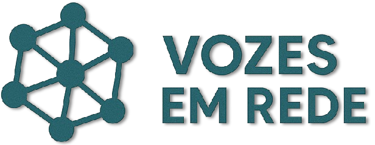

<body data-page="index-page">

  

  
  <h3 style="text-align: center">

  

  <b>Vozes em Rede</b> é uma solução inovadora que transforma manifestações públicas em conhecimento estruturado para apoiar gestores públicos na tomada de decisão baseada em evidências. Utilizando técnicas de machine learning para clusterização semântica, o sistema agrupa manifestações em temas recorrentes, identifica padrões e apresenta insights de forma visual e acessível.
  

  <h2 style="font-weight: bold; text-align: left; margin-top: 2em;">Objetivos do Projeto</h2>
  <ul style="text-align: left;">
    <li>Coletar manifestações públicas de múltiplas fontes de forma automatizada e periódica.</li>
    <li>Normalizar, limpar e padronizar os textos coletados para garantir qualidade analítica.</li>
    <li>Agrupar manifestações em clusters temáticos, facilitando a identificação de demandas sociais.</li>
    <li>Proporcionar uma interface intuitiva, acessível e responsiva para gestores e analistas.</li>
  </ul>

   
  </h3>

<h1 style="font-weight: bold; text-align: center"> Equipe </h1>

<a class="pessoa" href="https://github.com/DonMtys">
  

    
  

  <h4 class="legenda">João Victor Cruz</h4>
</a>
<a class="pessoa" href="https://github.com/zlimaz">
  

    
  

  <h4 class="legenda">Miguel Arthur</h4>
</a>
<a class="pessoa" href="https://gitlab.com/StrangeUnit28">
  

    
  

  <h4 class="legenda">Rafael Bosi</h4>
</a>

