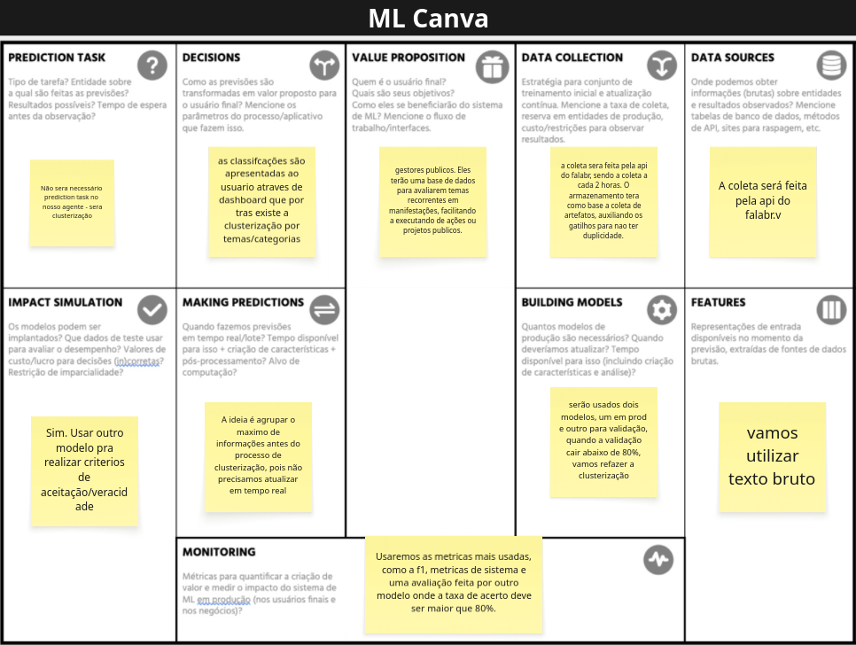

# ML Canvas

### Descrição da Ferramenta
O ML Canvas é uma ferramenta visual para planejamento e comunicação de projetos de machine learning. Ele permite mapear, de forma estruturada, as tarefas de previsão, decisões, fontes e coleta de dados, construção de modelos, métricas e demais aspectos essenciais para o sucesso do projeto.

### Aplicação no Projeto
No Vozes em Rede, o ML Canvas foi utilizado para organizar e alinhar as etapas do desenvolvimento do modelo de clusterização semântica. Inicialmente, a coleta de dados seria feita via API do FalaBR, mas devido a obstáculos de acesso, a estratégia foi adaptada para utilizar dados de sites de notícias e redes sociais, garantindo a viabilidade do projeto no prazo disponível.

### Principais Insights
- O foco do modelo é a clusterização de manifestações, sem previsão tradicional.
- As classificações são apresentadas ao usuário via dashboards temáticos.
- A coleta e armazenamento dos dados foram adaptados para fontes públicas acessíveis.
- O modelo será avaliado por métricas como F1-score, com revalidação caso a acurácia caia abaixo de 80%.
- O uso de texto bruto como entrada e a ausência de necessidade de atualização em tempo real simplificam o pipeline.

	
	
<em>Figura 1: ML Canva detalhando o fluxo e decisões do modelo de clusterização do Vozes em Rede.</em>

