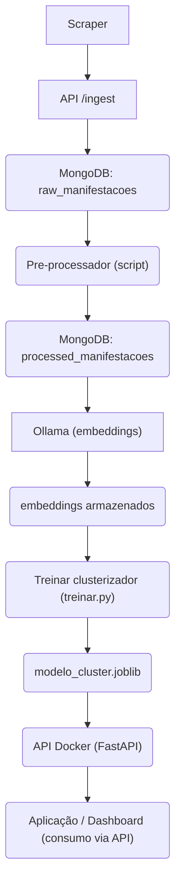

# Arquitetura da Solução — Vozes em Rede

## Visão geral 

Esta arquitetura foi projetada para rodar localmente no Mac Studio da equipe, usando ferramentas open-source e de baixo custo operacional. A solução é composta por dois serviços principais:

- Serviço 1 — Ollama (modelo de embeddings) — roda nativamente no macOS.
- Serviço 2 — API de Clusterização (FastAPI) — roda dentro de um container Docker e consome o Ollama para gerar embeddings.

## Motivação

Rodar a pipeline localmente no Mac Studio permite aproveitamento do poder computacional (Apple Silicon), simplicidade operacional e controle total dos dados, reduzindo custos com nuvem durante a fase de desenvolvimento e POC.

## Componentes Principais

- Ollama (serviço de embeddings)
    - Modelo: `nomic-embed-text` (ou similar).
    - Expõe API local em `http://localhost:11434`.
    - Roda como aplicativo nativo no macOS (barra de menus).

- API de Clusterização

    - Framework: FastAPI + Uvicorn.
    - Executa dentro de um container Docker.
    - Expondo endpoint: `POST /clusterizar`.
    - Consome embeddings do Ollama e usa o modelo treinado (`modelo_cluster.joblib`) para prever clusters.

- Banco de Dados

    - MongoDB (local ou docker) para armazenar manifestações brutas, metadados e resultados.
    - Alternativa leve: um diretório com arquivos JSON/CSV para projetos POC.

- Scripts de Treinamento

    - Python scripts que geram embeddings, treinam o clusterizador e salvam o modelo com `joblib`.

## Fluxo de Dados 

Este projeto adota um fluxo de dados linear e explícito, do scrapping até o consumo pela aplicação (1 → 7). Cada etapa descreve entradas, saídas e pontos de integração.

- **1 - Coleta (Scraper)**

    - Origem: sites públicos, fóruns, canais de atendimento (ex.: Reclame Aí, redes sociais, formulários públicos).
    - Saída: documentos brutos (JSON) com metadados (timestamp, url, fonte, id_origem).
    - Modo de entrega: duas opções (ainda não definido):
        - Push direto ao MongoDB via biblioteca (pymongo).
        - Push para um endpoint de ingestão HTTP (FastAPI) que valida e escreve no MongoDB.

- **2 - Armazenamento inicial (MongoDB)**

    - Banco: coleção `raw_manifestacoes` contendo o documento bruto e metadados.
    - Cada documento recebe um campo `status` inicial (ex.: `"status": "raw"`) e um `_id` gerado pelo MongoDB.

- **3 - Pré-processamento (batch ou streaming)**

    - Job local ou cron (script Python) que lê documentos `status: raw` da coleção, aplica limpeza, normalização, extração de campos e atualiza/insere em `processed_manifestacoes` com `status: processed`.
    - Mantém rastreabilidade: campo `raw_id` que referencia o documento original.

- **4 - Geração de embeddings (Ollama)**

    - Serviço Ollama recebe trechos de texto do documento processado e responde com vetores (float array).
    - Embeddings são salvos em MongoDB (ex.: campo `embedding` no documento processado) ou em serviço de vector-db, conforme necessidade.

- **5 - Treinamento do clusterizador (batch)**

    - Script `treinar.py` carrega embeddings, treina clusterizador (HDBSCAN / KMeans) e grava `models/modelo_cluster.joblib`.

- **6 - Deploy da API de clusterização (FastAPI)**

    - Container Docker que expõe endpoints:

        - `POST /clusterizar` — recebe texto, obtém embedding (Ollama) e retorna cluster e metadados.
        - `GET /modelo/status` — versão do modelo e data do treino.

    - Também queremos incluir a API o endpoint `POST /ingest` para receber dados do scraper.

- **7 - Consumo pela aplicação / Dashboards**

    - Dashboards, ferramentas de BI ou front-ends fazem chamadas à API (`/clusterizar` ou endpoints de consulta) para obter agrupamentos, métricas e visualizações.

## Fluxograma 

O diagrama abaixo resume do scrapping ao consumo pela aplicação:

