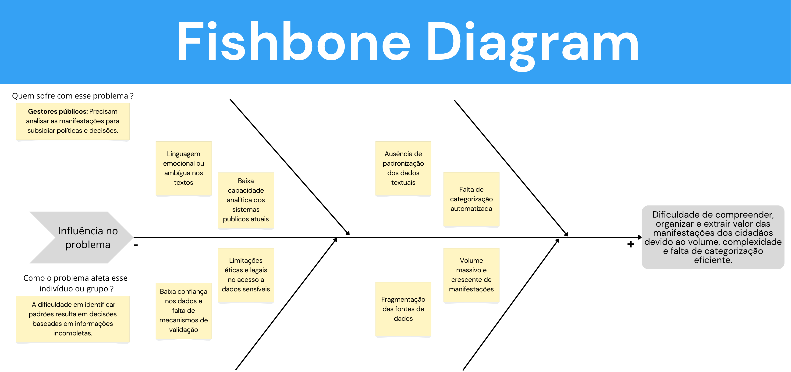
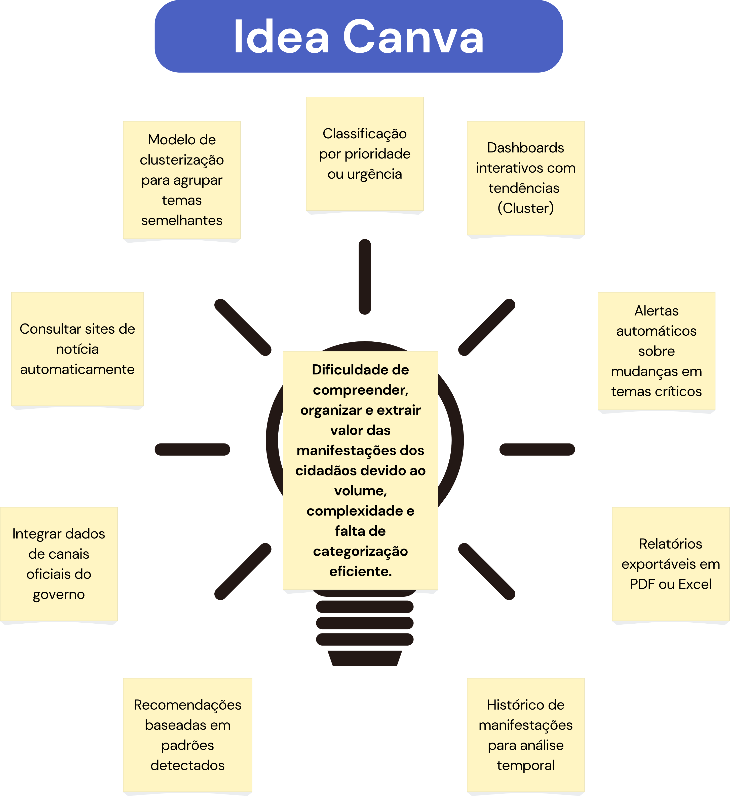
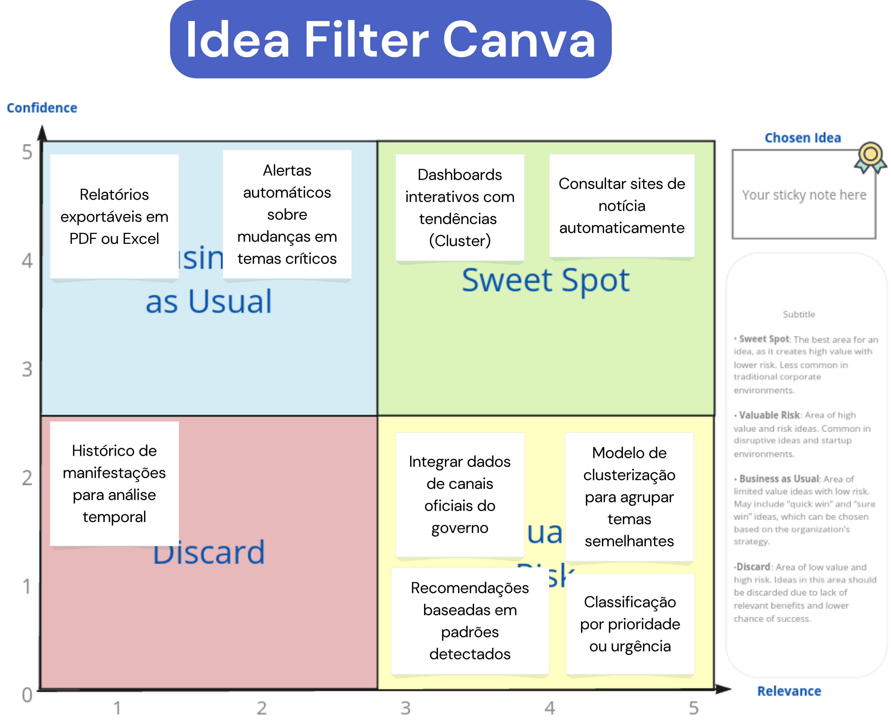
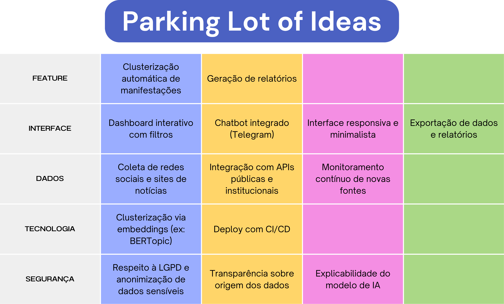

# Visão do Produto

## Fishbone

### Descrição da Ferramenta
O Diagrama de Causa e Efeito (Fishbone) é uma ferramenta visual utilizada para identificar, organizar e ilustrar as principais causas de um problema central. Ele permite mapear fatores que contribuem para desafios complexos, facilitando a análise sistêmica e a priorização de soluções.

### Aplicação no Projeto
No contexto do Vozes em Rede, o Fishbone foi empregado para mapear as causas que dificultam a análise eficiente de manifestações públicas. O principal afetado é o gestor público, que enfrenta desafios como o grande volume de dados, a falta de padronização e a ambiguidade das manifestações.

### Principais Insights
- O principal problema identificado é a dificuldade em transformar manifestações dispersas e desestruturadas em conhecimento acionável para a tomada de decisão baseada em evidências.
- A análise evidenciou a necessidade de mecanismos automáticos de categorização e clusterização para apoiar a gestão pública.

	
	
<em>Figura 1: Diagrama de Causa e Efeito (Fishbone)</em>

## Idea Canva

### Descrição da Ferramenta
O Idea Canva é uma ferramenta de brainstorming visual que permite organizar ideias, funcionalidades e desafios do projeto em diferentes categorias, facilitando a priorização e o alinhamento estratégico.

### Aplicação no Projeto
No Vozes em Rede, o Idea Canva foi utilizado para mapear as principais funcionalidades e necessidades do sistema, desde a integração de dados até a geração de relatórios e dashboards interativos.

### Principais Insights
- Necessidade de integrar dados de canais oficiais do governo e sites de notícias.
- Importância de dashboards interativos, clusterização de temas e alertas automáticos para gestores.
- Dificuldade central: compreender, organizar e extrair valor das manifestações devido ao volume, complexidade e falta de categorização eficiente.

	
	
<em>Figura 2: Idea Canva com funcionalidades e desafios mapeados para o Vozes em Rede.</em>

## Idea Filter Canva

### Descrição da Ferramenta
O Idea Filter Canva é uma matriz de priorização que avalia ideias e funcionalidades com base em critérios como confiança e relevância, ajudando a identificar o que deve ser priorizado, mantido ou descartado.

### Aplicação no Projeto
No Vozes em Rede, a ferramenta foi usada para filtrar e priorizar ideias levantadas no brainstorming, destacando aquelas com maior potencial de impacto e viabilidade técnica.

### Principais Insights
- Priorização de dashboards interativos, clusterização de temas e classificação por urgência.
- Recomendações baseadas em padrões detectados e integração de dados oficiais também foram destacadas.
- Algumas ideias, como histórico de manifestações e relatórios exportáveis, foram consideradas menos prioritárias.

	
	
<em>Figura 3: Idea Filter Canva priorizando funcionalidades para o projeto.</em>

## Parking Lot Idea Canva

### Descrição da Ferramenta
O Parking Lot Idea Canva é um quadro visual para registrar ideias, funcionalidades e requisitos que podem ser explorados futuramente, mas que não são prioridade imediata.

### Aplicação no Projeto
No Vozes em Rede, a ferramenta foi utilizada para organizar sugestões de features, interface, dados, tecnologia e segurança, servindo como repositório de inovações e melhorias para próximas etapas.

### Principais Insights
- Destaque para clusterização automática, dashboards interativos, coleta de dados de múltiplas fontes e respeito à LGPD.
- Integração com APIs públicas, explicabilidade do modelo e exportação de relatórios são pontos de atenção para o futuro.

	
	
<em>Figura 4: Parking Lot Idea Canva com backlog de ideias para o Vozes em Rede.</em>

## Descrição do Produto

O Vozes em Rede surge da necessidade de transformar manifestações públicas, expressas em diferentes meios e formatos, em conhecimento estruturado que auxilie gestores públicos na formulação de políticas e decisões baseadas em evidências. O projeto tem como núcleo tecnológico um modelo de aprendizado de máquina baseado em clusterização semântica, capaz de agrupar manifestações de cidadãos em temas recorrentes e inter-relacionados.

A concepção do produto partiu da constatação de que os gestores enfrentam sérias dificuldades para compreender o volume, a complexidade e a natureza ambígua das manifestações sociais. Mesmo quando os dados estão disponíveis, a falta de categorização e padronização torna inviável a análise manual. O Vozes em Rede busca resolver esse problema por meio de um sistema que identifica automaticamente padrões e tópicos temáticos, organizando as vozes dispersas da população em clusters interpretáveis.

Cada manifestação será analisada pelo modelo de forma contextual, considerando que uma mesma manifestação pode abranger múltiplos temas. Assim, o sistema não apenas atribui um cluster principal, mas também estima o grau de pertencimento (em porcentagem) a outros temas correlatos, oferecendo uma visão mais precisa da multiplicidade de sentidos e intenções contida nas mensagens.

Durante o desenvolvimento conceitual, diferentes públicos-alvo foram considerados — jornalistas, pesquisadores e entidades sociais —, mas a análise do problema (refletida no Fishbone Diagram) evidenciou que os gestores públicos são o público que mais sofre com a falta de mecanismos analíticos para compreender manifestações cidadãs. A incapacidade de identificar padrões entre dados textuais dispersos leva à formulação de políticas baseadas em percepções parciais e não em tendências reais.

Neste contexto, o Vozes em Rede propõe um avanço técnico e social: criar uma ferramenta de análise automatizada de manifestações, apoiada em clusterização semântica e métricas de similaridade contextual, que traduza dados desestruturados em insights temáticos concretos. Por “manifestações”, entende-se qualquer forma de expressão cidadã, desde relatos, denúncias e comentários em canais oficiais até discussões em ambientes digitais.

Em síntese, a visão do produto é oferecer um modelo de inteligência coletiva aplicada à gestão pública, capaz de transformar o ruído das redes e plataformas em mapas temáticos de demandas sociais, evidenciando com precisão o que a sociedade comunica, onde estão as principais tensões e quais temas emergem com maior relevância.

